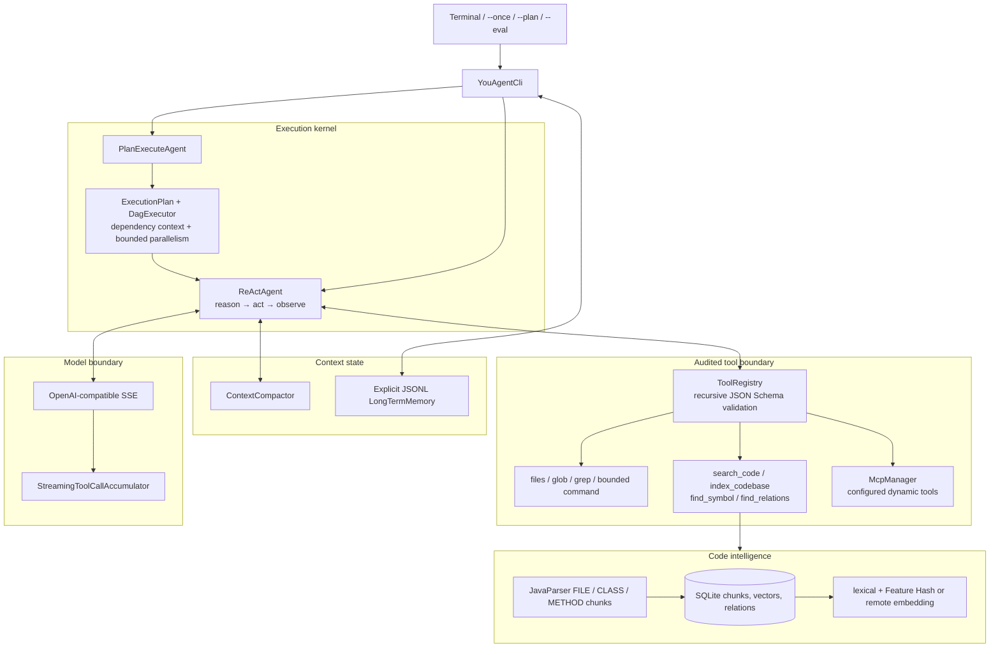
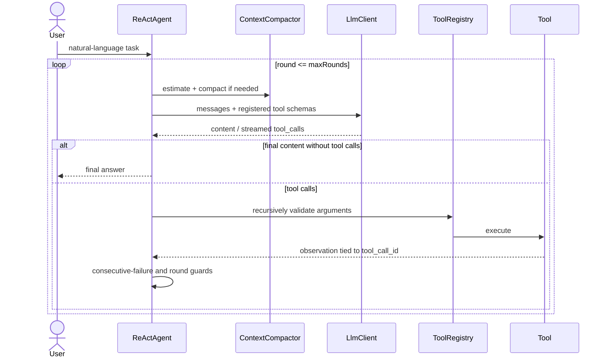
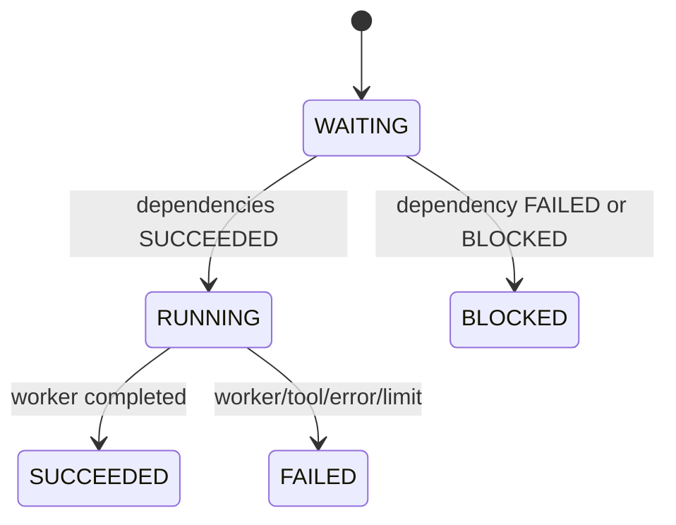

# You Agent CLI

[](https://openjdk.org/projects/jdk/17/)
[](https://github.com/Linji-x/you-agent-cli/actions/workflows/ci.yml)
[](LICENSE)

You Agent CLI 是一个 Java 17 终端代码 Agent：把自然语言任务转换为可审计的模型请求、工具调用、DAG 节点、代码检索证据和确定性退出状态，而不是只包装一个聊天接口。

> 本仓库由作者独立设计与实现；来源和资产边界见 [NOTICE.md](NOTICE.md)。

核心能力：

- ReAct + OpenAI-compatible Function Calling，支持 SSE 工具参数增量合并、递归 Schema 校验和 Observation 回灌。
- Plan-and-Execute DAG，支持依赖输出传递、失败传播、默认串行和显式受控并行。
- JavaParser + SQLite 代码索引，并以 `search_code` 等四个工具真实接入 Agent 主链路。
- 显式长期 Memory、上下文压缩、MCP stdio/Streamable HTTP 动态工具注册。
- JUnit、25 项 deterministic offline conformance benchmark、人工标注检索评测和真实模型在线评测入口。

## 30 秒启动

要求 Java 17+。首次执行会下载 Maven 3.9.11 并校验 Apache 官方 SHA-512，后续使用本地缓存。

```powershell
# Windows：真实离线 Demo，不需要 API Key
.\run.ps1 --demo

# 编译、JUnit、JaCoCo、打包、Demo、25 项离线一致性评测
.\run.ps1 --verify
```

```bash
./run.sh --demo
./run.sh --verify
```

Demo 会在临时目录真实执行 `ExecutionPlan → DagExecutor → ToolRegistry → write_file/read_file`：

```text
INPUT  Create a Java greeting file, then verify its content.
PLAN
  inspect <- [] : Inspect the sandbox
  create <- [inspect] : Create the requested Java source
  verify <- [create] : Read the created source as verification
TOOLS
  list_directory -> SUCCEEDED :
  write_file -> SUCCEEDED : wrote demo-output\Hello.java (78 chars)
  read_file -> SUCCEEDED : public final class Hello { public static String greet() { return "hello"; } }
RESULT SUCCESS; verified demo-output/Hello.java
```

### 配置真实模型

```powershell
Copy-Item .env.example .env
# 只填写自己的 endpoint、model 和 Key
.\run.ps1 --once "定位订单校验逻辑并给出代码证据"
```

```dotenv
YOU_AGENT_API_KEY=replace_with_your_own_key
YOU_AGENT_BASE_URL=https://api.example.com/v1
YOU_AGENT_MODEL=replace_with_model_name
```

`.env` 已被 Git 忽略；程序不会打印 Key，HTTP 错误仅报告状态码。

## 架构



架构把模型建议与确定性执行分开：LLM 可以提出工具调用或任务图，但参数校验、路径约束、并发资格、状态转换、失败传播、输出上限和循环终止由 Java 代码决定。

## 核心执行流程

### ReAct + Function Calling



`StreamingToolCallAccumulator` 按 `index` 合并分散在多个 SSE delta 中的 `id`、函数名和 JSON 参数；完整 JSON 形成前不会进入工具层。

重复失败熔断只统计“连续相同调用 + 相同错误码”。成功调用或不同失败会重置计数，避免历史偶发失败造成误熔断。

### Plan-and-Execute DAG

Planner 只返回 JSON 图；Java 在执行前拒绝未知依赖、自依赖和环。每个下游节点会收到其直接依赖节点的真实输出：

```text
Overall objective: ...
Current node verify: ...
Direct dependency outputs (trusted execution evidence):
- implement: changed src/OrderValidator.java; tests passed
```

节点默认 `parallelSafe=false`。只有同一 ready batch 中明确标记为安全的节点才进入有界线程池；`exclusiveResources` 相交的任务即使标记为安全也会串行，执行报告始终按计划顺序输出。



最大并行度由 `YOU_AGENT_PLAN_MAX_PARALLELISM` 配置，范围 1–32，默认 4。

## 工具与安全边界

内置工具：

```text
read_file / write_file / list_directory / glob_files / grep_code / execute_command
search_code / index_codebase / find_symbol / find_relations
```

- 文件工具通过规范化路径和符号链接检查限制在 workspace 内。
- ToolRegistry 递归验证 object、array、items、required、enum 和 `additionalProperties`。
- `execute_command` 接收参数数组，不拼 shell 字符串；读取时最多保留 64KB，但会继续排空管道避免子进程阻塞。
- 命令超时会终止父进程和已发现的后代进程。
- 命令的启动目录是 workspace，但它**不是容器沙箱**；进程仍拥有当前 OS 账号允许的文件和网络权限。

## 代码检索

JavaParser 产生 `FILE / CLASS / METHOD` 块，SQLite 持久化文件、符号、行号、源码证据、向量和 `CONTAINS / EXTENDS / IMPLEMENTS / CALLS / IMPORTS` 关系。

Agent 可自主调用：

- `search_code`：自然语言/符号混合检索，缺少索引时自动安全构建。
- `index_codebase`：显式重建索引。
- `find_symbol`：按类或方法名查找。
- `find_relations`：查询代码关系。

每条结果含路径、符号、行号、块类型、分数和截断后的代码证据；单次工具结果上限 12,000 字符。

默认 `FeatureHashEmbeddingModel` 是**离线、可重复的词法特征哈希基线**，不是学习得到的专业语义 Embedding。默认混合分数：

```text
score = 0.52 * vector cosine + 0.40 * lexical coverage + type boost
```

显式配置下列变量后可切换 OpenAI-compatible Embedding；缺少任一关键字段时继续使用 Feature Hash：

```dotenv
YOU_AGENT_EMBEDDING_API_KEY=replace_with_your_own_embedding_key
YOU_AGENT_EMBEDDING_BASE_URL=https://api.example.com/v1
YOU_AGENT_EMBEDDING_MODEL=replace_with_embedding_model
```

## MCP 主链路

将 [mcp.example.json](mcp.example.json) 复制为 `.you-agent/mcp.json`，启用并填写自己的 server。支持环境变量占位符 `${VAR}`，解析后的值不会写入状态或日志。

```json
{
  "servers": {
    "local": {
      "transport": "stdio",
      "command": ["my-mcp-server", "--stdio"],
      "env": {"TOKEN": "${MY_MCP_TOKEN}"},
      "timeoutSeconds": 15
    },
    "remote": {
      "transport": "streamable-http",
      "url": "https://mcp.example.com/mcp",
      "headers": {"Authorization": "Bearer ${MY_MCP_TOKEN}"}
    }
  }
}
```

启动链路为：

```text
load config → create transport → initialize → validate negotiated version
→ notifications/initialized → tools/list → register mcp__{server}__{tool}
```

```powershell
.\run.ps1 --mcp-status
```

初始化失败会关闭 Client/Transport 并记录 `FAILED`；CLI 结束按逆序关闭所有 Client。stdio 请求超时会关闭进程和 stdout reader，使阻塞读取任务可以退出。Streamable HTTP 支持 JSON、SSE 和 `Mcp-Session-Id` 复用。

当前支持 `initialize`、`tools/list`、`tools/call`、stdio 和 Streamable HTTP；暂不支持 OAuth、sampling、resources/prompts、服务端自动重启和会话恢复。

## 上下文与 Memory

- 当前会话保存 system/user/assistant/tool 消息；跨会话事实只有显式 `--save` 或 `/save` 才写入 JSONL。
- Token 估算覆盖消息内容、Tool Call ID/名称/参数和工具结果。
- 默认达到预算 80% 时裁剪超长工具输出、保留最近两个 user turn，并摘要更早历史。
- 摘要提示和确定性降级摘要都会保留关键工具调用、修改文件、验证结果与失败路径。
- 长期记忆检索同时使用普通词项和可解释的中文 1–3 字 N-gram；默认只注入最相关的 5 条事实。

## 失败处理与终止

| 场景 | 确定性行为 | 状态/错误 |
|---|---|---|
| 模型返回最终文本且无工具 | 完成 | `COMPLETED` |
| 达到最大轮次 | 停止继续请求 | `MAX_ROUNDS` |
| 连续三次相同失败 | 熔断 | `REPEATED_FAILURE` |
| 空内容且无工具 | 立即停止 | `EMPTY_RESPONSE` |
| provider length finish reason | 保留已有内容并停止 | `LENGTH_LIMIT` |
| HTTP/解析异常 | 不输出 Key | `CLIENT_ERROR` |
| 工具缺失或参数错误 | 结构化回灌 | `UNKNOWN_TOOL` / `INVALID_ARGUMENTS` |
| 路径逃逸 | 拒绝 | `POLICY_DENIED` |
| 命令超时/非零退出 | 终止树或回灌输出 | `TIMEOUT` / `NON_ZERO_EXIT` |
| DAG 父节点失败 | 传递依赖阻塞，独立分支继续 | `FAILED` / `BLOCKED` |

## 验证与评测

四类证据不混用：

| 类型 | 命令 | 证明什么 | 不证明什么 |
|---|---|---|---|
| JUnit + JaCoCo | `mvn clean verify` | 状态机、协议、校验、进程、持久化回归 | 在线模型质量 |
| deterministic offline conformance benchmark | `--benchmark` | 25 个固定场景的确定性工程一致性 | 模型任务完成率 |
| 代码检索评测 | `--retrieval-eval` | 人工标注数据上的 Recall@5、MRR@10、延迟 | 大规模语义搜索质量 |
| 在线 Agent 评测 | `--eval` | 真实模型在临时工作区的完成率、轮次、工具数、耗时、估算 Token | 跨模型永久排名 |

固定 25 项定义见 [benchmarks/tasks.json](benchmarks/tasks.json)，实际运行报告见 [benchmarks/results/latest.md](benchmarks/results/latest.md)：**25/25 PASS**。

代码检索数据集见 [eval/retrieval/ground-truth.json](eval/retrieval/ground-truth.json)，实际生成报告见 [eval/results/retrieval-latest.md](eval/results/retrieval-latest.md)。当前 8 条夹具基线：

| 配置 | Recall@5 | MRR@10 |
|---|---:|---:|
| keyword-only | 1.000 | 1.000 |
| Feature Hash hybrid | 1.000 | 1.000 |

数据集很小，结果用于证明评测链路可复现，不代表真实大型仓库效果。

在线评测含代码定位、文件修改、命令执行、错误恢复和 Plan 五类任务，使用文件内容、退出码及真实工具事件验证。必须显式配置模型和 Key；仓库当前**不提交在线结果**，因为没有在公开发布环境中执行真实模型调用。不存在随机 PASS、硬编码成功或手工日志。

CI 在 Java 17 执行 `clean verify`、Demo、25 项一致性评测、检索评测、密钥扫描和 JaCoCo 上传，并在 Java 21 再验证 Java 17 字节码兼容性。

## 常用命令

```text
.\run.ps1 --once "定位并解释认证逻辑"
.\run.ps1 --plan "定位问题、修改并运行测试"
.\run.ps1 --index
.\run.ps1 --search "token validation"
.\run.ps1 --retrieval-eval
.\run.ps1 --eval
.\run.ps1 --save "本项目统一使用 Java 17"
.\run.ps1 --memory
.\run.ps1 --mcp-status
```

## 技术选型

| 选择 | 用途与理由 | 主要取舍 |
|---|---|---|
| Java 17 | LTS、明确类型和成熟 IO/并发原语，适合展示协议与状态机 | 终端 UI 保持轻量 |
| Jackson | Function Calling、MCP、配置与报告 JSON | 协议 DTO 自行维护 |
| OkHttp | LLM SSE、Embedding、Streamable HTTP MCP | 不绑定厂商 SDK |
| JavaParser | 稳定的类/方法边界与行号 | 当前索引仅覆盖 Java |
| SQLite JDBC | 单文件保存块、向量和关系 | 相似度在 Java 侧计算，面向中小仓库 |
| Feature Hash | 零 Key、离线可重复基线 | 不具备专业语义 Embedding 质量 |
| Maven Shade | 单 JAR 交付 | JAR 体积包含依赖 |
| JUnit 5 + JaCoCo | 回归验证与覆盖率报告 | 覆盖率不等于模型质量 |

没有引入 LangChain/Spring AI：仓库目标是让 ReAct、DAG、工具协议、压缩和 MCP 生命周期在代码中可直接阅读与追问。

## 当前限制

- Feature Hash 仅是词法向量基线；大型或跨语言仓库需要专业 Embedding、增量索引和向量数据库优化。
- `execute_command` 不是容器/VM 沙箱；生产环境应增加容器隔离、网络策略和更强审批。
- 在线 Agent 质量、费用和稳定性取决于用户选择的模型与 provider。
- MCP 当前聚焦工具调用；OAuth、sampling、resources/prompts、自动重启和 recovery 尚未实现。
- DAG 的 `parallelSafe` 与 `exclusiveResources` 依赖计划声明；默认 false 保持保守，但这不是通用事务型文件锁系统。
- 在线评测仅含五个公开固定任务，不能代表真实软件工程分布。

后续计划见 [ROADMAP.md](ROADMAP.md)，版本变化见 [CHANGELOG.md](CHANGELOG.md)。

## 项目结构

```text
src/main/java/dev/youagent/
├── agent/       ReAct loop, events, deterministic exit reasons
├── plan/        validated DAG, dependency context, controlled parallelism
├── tool/        recursive schemas, workspace guard, bounded process execution
├── search/      JavaParser, Feature Hash/remote embedding, SQLite, agent tools
├── mcp/         config loader, manager, client, stdio/HTTP transports
├── memory/      explicit facts, Chinese retrieval, context compaction
├── llm/         OpenAI-compatible SSE and streaming tool-call merge
├── eval/        retrieval metrics and real online-agent harness
├── benchmark/   25 deterministic offline conformance scenarios
├── demo/        offline end-to-end demo
└── cli/         command entrypoint
```

## 安全、来源与许可证

- `.env`、`.you-agent/`、`target/`、`.tools/`、Memory、索引和在线评测结果不进入 Git。
- 测试、离线评测和检索夹具均为公开合成数据；仓库不含 API Key、公司代码、公司数据或内部 URL。
- 详细安全边界见 [SECURITY.md](SECURITY.md)。
- 本项目使用 MIT License；来源声明见 [NOTICE.md](NOTICE.md)，依赖许可证见 [THIRD_PARTY_NOTICES.md](THIRD_PARTY_NOTICES.md)。

本仓库由作者独立设计与实现，未引入未经授权的非开源代码、Prompt、测试、付费教程文档或图片。
