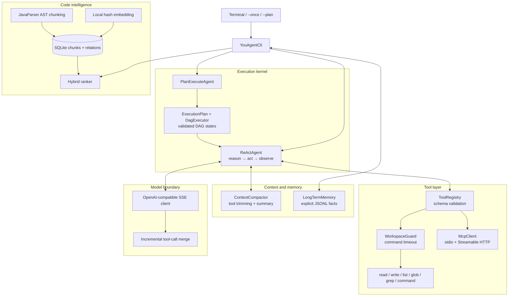
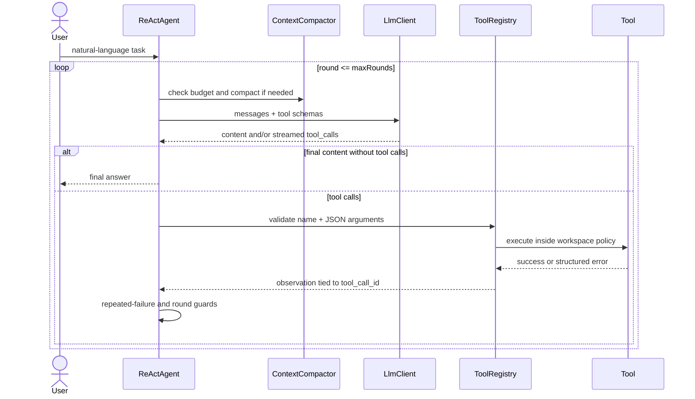
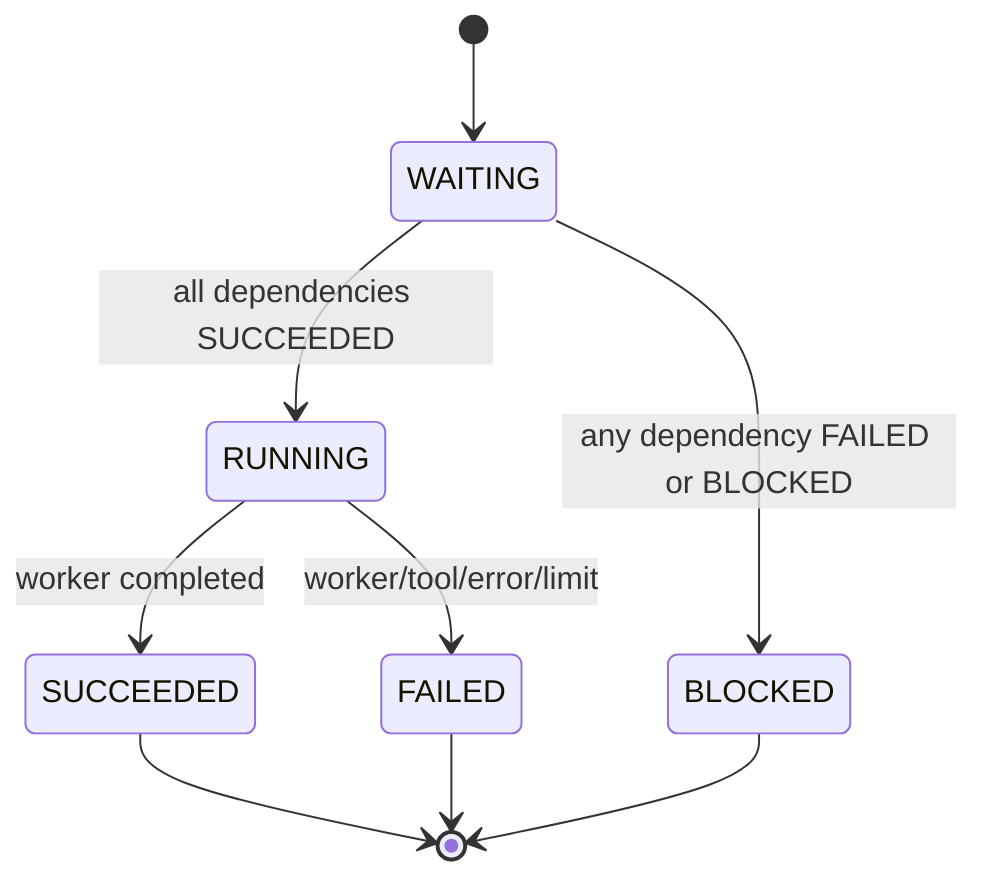
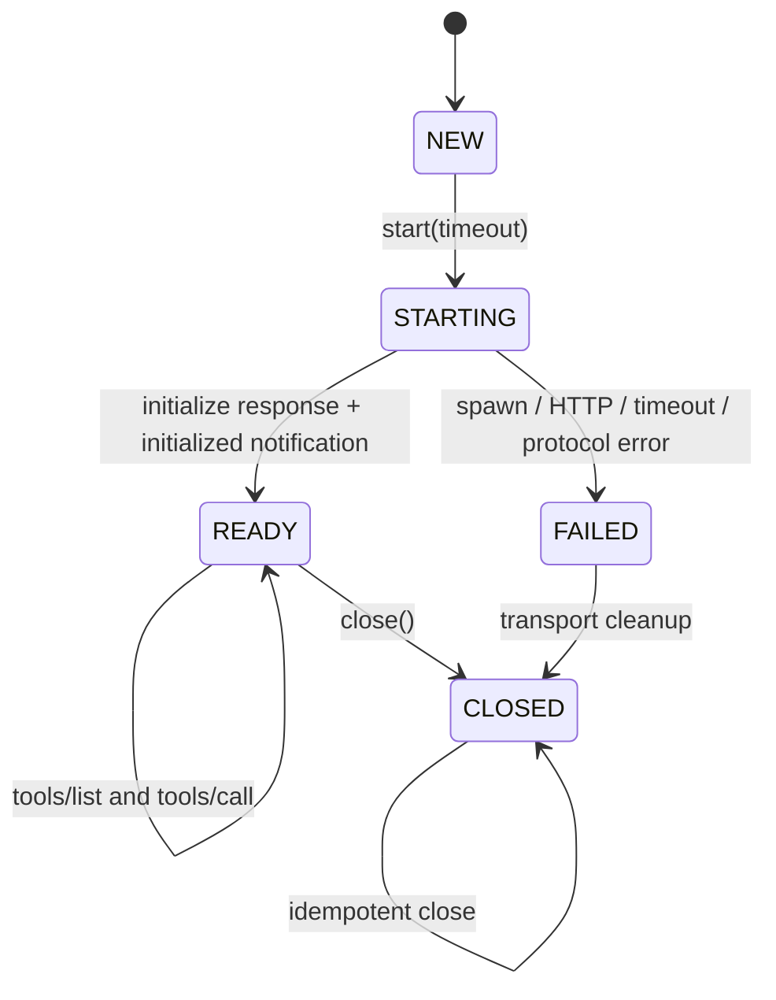

# You Agent CLI

[](https://openjdk.org/projects/jdk/17/)
[](https://github.com/Linji-x/you-agent-cli/actions/workflows/ci.yml)
[](LICENSE)

一个基于 Java 17 的终端代码开发 Agent：通过自然语言完成代码检索、文件操作、命令执行、DAG 任务规划、上下文管理和 MCP 外部工具调用。

> 本仓库是独立 clean-room 实现。它不包含非开源 Java PaiCLI 的源码、测试、Prompt、文档或图片。项目范围受到终端 Agent、ReAct、MCP 以及 PaiCLI 公开产品描述的启发，具体边界见 [NOTICE.md](NOTICE.md)。

**项目经历写法**：`You Agent CLI｜个人 clean-room 设计与实现｜2026.04–至今`。该日期覆盖个人学习与原型阶段；公开仓库版本于 2026.08 重写，用于排除受限教程材料并形成可审计的原创实现。

## 为什么值得看

- 不是聊天壳：核心路径真实执行 `LLM → Function Calling → Schema 校验 → Tool → Observation → 下一轮 LLM`。
- 不是只写 happy path：最大轮次、重复失败熔断、DAG 失败传播、路径围栏、命令超时、MCP 启动失败都有确定性退出。
- 不是只给截图：核心能力有自动化测试，另有 25 个固定离线实验任务及机器生成的真实结果。
- 不依赖付费模型即可验收：`--demo`、单元测试和 25 项 benchmark 均可离线执行；真实 LLM 调用使用用户自己的 OpenAI-compatible API。

## 架构



架构刻意把“模型决策”和“确定性执行”分开：LLM 可以提出工具调用或任务图，但参数校验、路径限制、状态转换、失败传播和循环终止都由 Java 代码控制。

## 核心流程

### ReAct + Function Calling



流式响应中的 `id`、函数名和 JSON 参数可以分散在多个 SSE delta 中；`StreamingToolCallAccumulator` 按 `index` 增量合并，并在工具执行前解析完整 JSON。无效 JSON 不会进入工具层。

### Plan-and-Execute DAG

`--plan` 先要求模型只返回 JSON 任务图，然后由 Java 验证引用和环，再按拓扑关系逐节点调用 ReAct worker。



- 未知依赖、自依赖和环在执行前拒绝。
- 父节点失败后，所有传递依赖节点变为 `BLOCKED`；独立分支仍可继续。
- `ExecutionPlan.append(...)` 支持补充规划，但追加后的整张图仍必须通过 DAG 校验。

## 技术选型与理由

| 选择 | 用途 | 为什么这样选 | 取舍 |
|---|---|---|---|
| Java 17 | 核心实现 | LTS、类型系统和并发/IO 基础稳定，适合展示底层协议与状态机 | 终端 UI 目前保持轻量，没有引入重量级框架 |
| Jackson | JSON、Function Calling、MCP | 显式控制消息和 Schema，便于审计流式增量合并 | 需要自己维护协议 DTO |
| OkHttp | LLM SSE、Streamable HTTP MCP | 同时覆盖普通 HTTP 和流式响应，超时控制清晰 | 未封装成特定厂商 SDK |
| JavaParser | Java AST 切块 | 能按类/方法建立稳定的语义边界和行号 | 非 Java 文件退化为实时 glob/grep |
| SQLite JDBC | 代码块、向量、关系持久化 | 单文件、无需服务、便于面试官直接复现 | 当前向量相似度在 Java 侧计算，适合中小仓库 |
| 本地 hash embedding | 默认离线语义信号 | 零密钥、可重复、benchmark 不受外部模型波动影响 | 语义质量低于专业 embedding API；接口可替换 |
| Maven Shade | 单 Jar 交付 | 一条命令构建和运行，面试机无需手工拼 classpath | 首次运行需要下载 Maven 与公开依赖 |
| JUnit 5 | 核心行为验证 | 参数清晰、临时目录隔离、无需真实 API Key | 在线模型质量另行评测，不混入单元测试结论 |

没有采用 LangChain/Spring AI：这个仓库的目标是展示 ReAct 循环、工具协议、DAG 状态转换、上下文压缩和 MCP 生命周期如何落到代码，而不是隐藏在框架回调中。

## 一条命令启动

要求：Java 17 或更高版本。仓库内脚本会在 `.tools/` 自举隔离的 Maven 3.9.11，不修改系统 Maven。

```powershell
# Windows：离线演示，不需要 API Key
.\run.ps1 --demo
```

```bash
# macOS / Linux
./run.sh --demo
```

首次执行需要联网下载 Maven 和公开依赖；之后可使用本地缓存。

### 配置真实模型

```powershell
Copy-Item .env.example .env
# 编辑 .env，只填自己的 Key、endpoint 和 model
.\run.ps1
```

```dotenv
YOU_AGENT_API_KEY=replace_with_your_own_key
YOU_AGENT_BASE_URL=https://api.example.com/v1
YOU_AGENT_MODEL=replace_with_model_name
```

`.env` 已被 `.gitignore` 排除。程序不会打印 API Key；HTTP 异常只报告状态码。

常用命令：

```text
.\run.ps1 --once "查找订单校验逻辑并说明证据"
.\run.ps1 --plan "先定位问题，再修改并运行测试"
.\run.ps1 --index
.\run.ps1 --search "token validation"
.\run.ps1 --save "本项目统一使用 Java 17"
.\run.ps1 --memory
```

## 完整演示：输入 → 规划 → 工具 → 结果

以下内容来自本仓库 `2026-08-22` 在 Java 17 上实际执行的 `\.\run.ps1 --demo`，不是手写伪日志：

```text
INPUT  Create a Java greeting file, then verify its content.
PLAN
  inspect <- [] : Inspect the sandbox
  create <- [inspect] : Create the requested Java source
  verify <- [create] : Read the created source as verification
TOOLS
  list_directory -> SUCCEEDED :
  write_file -> SUCCEEDED : wrote demo-output\Hello.java (78 chars)
  read_file -> SUCCEEDED : public final class Hello { public static String greet() { return "hello"; } }
RESULT SUCCESS; verified demo-output/Hello.java
```

演示使用临时工作区并在结束后清理；执行的确是生产代码里的 `ExecutionPlan`、`DagExecutor`、`ToolRegistry`、`write_file` 和 `read_file`。

## 失败处理与循环终止

| 场景 | 确定性行为 | 最终状态/错误 |
|---|---|---|
| 模型直接返回文本且无工具 | 自动完成 | `COMPLETED` |
| 达到 `YOU_AGENT_MAX_ROUNDS` | 不再请求模型 | `MAX_ROUNDS` |
| 完全相同的工具调用连续失败 3 次 | 熔断，避免死循环和费用浪费 | `REPEATED_FAILURE` |
| 模型返回空内容且无工具 | 立即停止 | `EMPTY_RESPONSE` |
| provider 返回 length finish reason | 保留已有内容并退出 | `LENGTH_LIMIT` |
| HTTP/解析/客户端异常 | Key 不写入错误文本 | `CLIENT_ERROR` |
| 外部取消信号 | 下一轮前检查 | `CANCELLED` |
| 工具名不存在 | 结构化 observation 回灌 | `ERROR[UNKNOWN_TOOL]` |
| 参数缺失、类型错误或多余字段 | 工具不执行 | `ERROR[INVALID_ARGUMENTS]` |
| 路径逃逸或符号链接逃逸 | 策略层拒绝 | `ERROR[POLICY_DENIED]` |
| 命令超时/非零退出 | 终止进程并回灌证据 | `TIMEOUT` / `NON_ZERO_EXIT` |
| DAG 节点失败 | 依赖节点递归阻塞，独立分支继续 | `FAILED` / `BLOCKED` |

`execute_command` 接收参数数组并直接使用 `ProcessBuilder`，不经过 shell 字符串拼接；工作目录固定为当前 workspace。

## 上下文压缩与 Memory

这里把两类状态分开：

1. **当前会话消息**：system/user/assistant/tool 序列，只在本次运行中参与 ReAct。
2. **跨会话事实**：只有用户显式执行 `--save` 或 `/save` 才写入 JSONL；按 project scope 隔离，`global` scope 可跨项目读取。

上下文估算达到预算的默认 80% 时：

1. 先把过长工具输出裁到 8,000 字符并标记；
2. 保留最近 2 个 user turn 的完整消息；
3. 让 LLM 摘要更早的目标、证据、改动、决策、失败路径和未完成事项；
4. 摘要调用失败时使用确定性降级摘要，主任务不会因此中断；
5. 新历史为 `system + summary + recent turns`，并记录压缩前后估算 token。

长期记忆检索使用当前任务关键词，只注入最相关的 5 条显式事实；临时任务不会被自动“学习”为永久偏好。

## 代码检索

`--index` 对 Java 文件建立三层块：`FILE / CLASS / METHOD`，并持久化：

- 文件、符号、行号和源码块；
- 本地 embedding 向量；
- `CONTAINS / EXTENDS / IMPLEMENTS / CALLS / IMPORTS` 关系。

默认混合排序为：

```text
score = 0.52 * cosine(embedding)
      + 0.40 * lexical coverage
      + type boost (METHOD 0.08 / CLASS 0.04)
```

这套默认实现是可离线重复的基线，不夸大为生产级语义模型；`EmbeddingModel` 接口可替换成远程 embedding 服务。

## MCP 生命周期



- **stdio**：启动参数数组形式的子进程，以逐行 JSON-RPC 通信；请求超时会取消等待，关闭时先正常销毁再强制结束。
- **Streamable HTTP**：支持 JSON 和 `text/event-stream` 响应，保存服务端返回的 `Mcp-Session-Id` 并用于后续请求。
- **握手**：发送 `initialize`，验证 `protocolVersion`，再发送 `notifications/initialized`。
- **动态工具**：`tools/list` 结果包装为 `mcp__{server}__{tool}`，仍经过统一 ToolRegistry Schema 校验。
- **失败清理**：启动或握手任一步失败都会进入 `FAILED` 并关闭 transport；`close()` 幂等。

当前实现不声称支持 OAuth、sampling 或服务端自动重启。

## 测试与真实实验结果

一条命令完成 Java 17 编译、单元测试、离线演示和 25 项 benchmark：

```powershell
.\run.ps1 --verify
```

核心测试：

| 能力 | 关键测试 | 主要断言 |
|---|---|---|
| ReAct | `ReActAgentTest` | 工具结果回灌、最大轮次、重复失败熔断 |
| DAG | `ExecutionPlanTest`, `PlanExecuteAgentTest` | 拓扑顺序、环检测、失败传播、自然语言计划执行 |
| Memory | `MemoryTest` | scope、持久化、检索、删除、压缩与最近任务保留 |
| 代码检索 | `CodeSearchTest` | AST 块、混合排序、SQLite、类方法关系 |
| Function Calling | `StreamingToolCallAccumulatorTest` | 多 delta 的 id/name/arguments 增量合并 |
| MCP | `McpClientTest` | initialize、工具发现/调用、关闭 |
| 安全工具层 | `ToolRegistryTest` | Schema 拒绝与路径逃逸拒绝 |

固定实验定义见 [benchmarks/tasks.json](benchmarks/tasks.json)，最新机器生成报告见 [benchmarks/results/latest.md](benchmarks/results/latest.md)。

当前基线（Java 17.0.16 / Windows 11 amd64 / 2026-08-22）：**25/25 PASS**。

| Area | Tasks | Result |
|---|---:|---:|
| ReAct | 5 | 5/5 |
| DAG | 5 | 5/5 |
| Memory | 5 | 5/5 |
| CodeSearch | 5 | 5/5 |
| Tools | 3 | 3/3 |
| MCP | 2 | 2/2 |

这些是确定性离线工程实验，证明状态机、持久化、工具与协议行为；它们不冒充在线 LLM 回答质量评测。

## 公开前安全边界

- `.env`、`.tools/`、`target/`、运行日志、Memory 和 SQLite 索引均不进入 Git。
- `.env.example` 只含占位符；仓库不包含 API Key、Bearer token、公司域名、公司代码、公司数据或内部文档。
- 文件工具只能访问 workspace；命令使用参数数组且有拒绝列表和超时。
- 测试和 benchmark 全部使用合成夹具及临时目录。
- CI 会在 Java 17 上执行测试、演示、benchmark 和基础密钥模式扫描。

安全问题请参阅 [SECURITY.md](SECURITY.md)。

## 项目结构

```text
src/main/java/dev/youagent/
├── agent/       ReAct loop, exit reasons and trace events
├── plan/        JSON planner, DAG validation, states and execution
├── tool/        registry, schemas, workspace policy and built-in tools
├── memory/      explicit long-term facts and context compaction
├── search/      JavaParser chunks, embedding, SQLite and hybrid ranking
├── mcp/         lifecycle, stdio/HTTP transports and dynamic tool adapter
├── llm/         provider boundary and streaming tool-call merge
├── benchmark/   25 deterministic experiment scenarios and report writer
├── demo/        real offline end-to-end demonstration
└── cli/         command-line entrypoint
```

面试阅读建议：`ReActAgent` → `ToolRegistry` → `ExecutionPlan` → `ContextCompactor` → `SqliteCodeIndex` → `McpClient`。

## 来源与许可证

本项目使用 MIT License。第三方 Maven 依赖保留各自许可证。

You Agent CLI 与 PaiCLI 无隶属关系。PaiCLI 的公开产品描述启发了功能范围，但本仓库没有复制其非开源 Java 版本的实现或资产；详情及参考资料见 [NOTICE.md](NOTICE.md)。依赖许可证摘要见 [THIRD_PARTY_NOTICES.md](THIRD_PARTY_NOTICES.md)。
